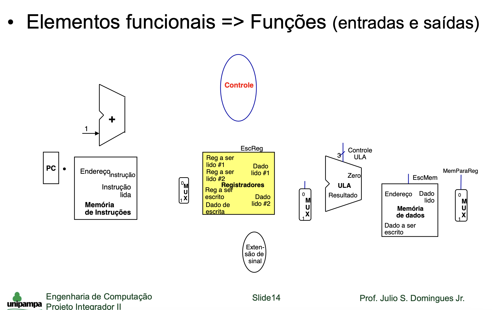

<h1> Projeto 1 - Mini MIPS </h1>

 Integrantes: João Eduardo, Jansen Avila e Gustavo Alves 

<h3> Requísitos Mínimos </h3>

 Registradores serão representados como matrizes 

<h2> Funções a serem implementadas </h2>
Funções</img>
<ul>
<li> Controle </li>
<li> Memória de Instruções </li>
<li> Registradores </li>

 Guarda as Instruções 

<li> ULA </li>
<li> Memória de Dados </li>
<li> MUX </li>

</ul>
